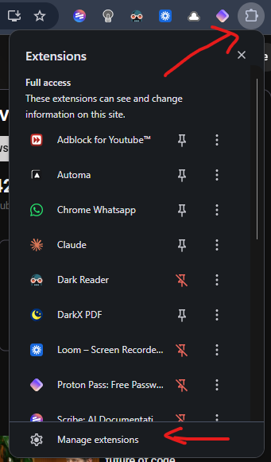
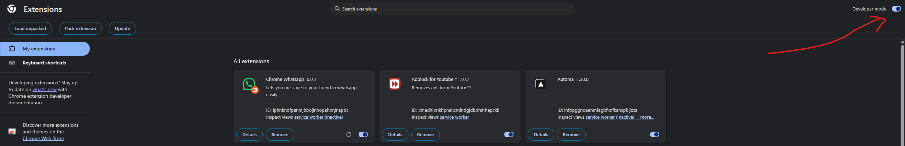
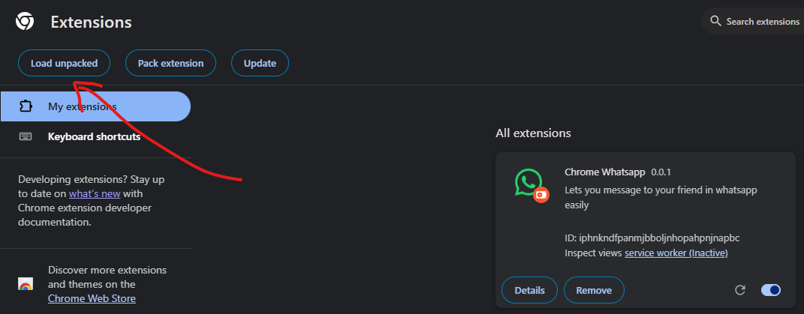
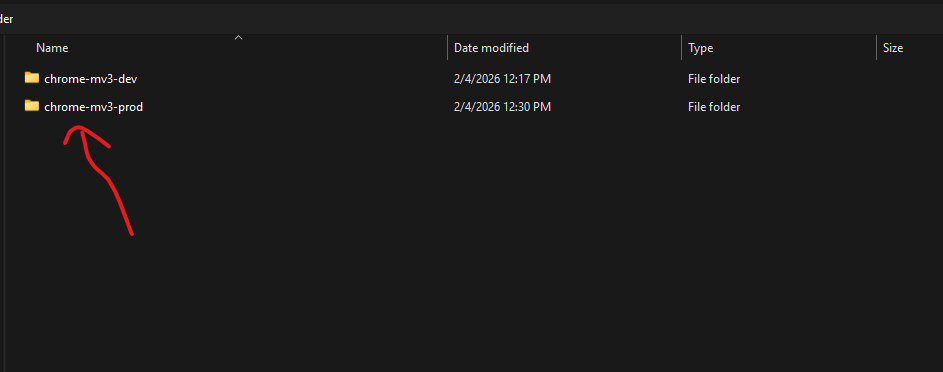
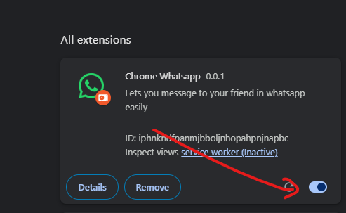

# Chrome WhatsApp Extension

## How to Install (Manual)

This guide explains how to manually load the extension into Google Chrome using the production build folder (`build/chrome-mv3-prod`).

### Prerequisites

- Google Chrome browser installed
- The project folder containing `build/chrome-mv3-prod`.

### Step-by-Step Instructions

1. **Open Extension Management Page**

   - Open Google Chrome.
   - Type `chrome://extensions` in the address bar and press **Enter**.
   - Alternatively, click the three dots menu (top right) $\to$ **Extensions** $\to$ **Manage Extensions**.

   >  > _Instructions: Click the menu to navigate to Extensions._

2. **Enable Developer Mode**

   - In the top right corner of the Extensions page, find the **Developer mode** toggle switch.
   - Turn it **ON** to reveal the developer options.

   >  > _Instructions: Toggle the switch to position ON._

3. **Load the Extension**

   - Click on the **Load unpacked** button that appears in the top left toolbar.

   >  > _Instructions: Click the "Load unpacked" button._

4. **Select the Build Folder**

   - A file explorer window will open.
   - Navigate to the root of your project directory.
   - Select the **`build/chrome-mv3-prod`** folder.
   - Click **Select Folder** (or **Open**).

   >  > _Instructions: Ensure you select the 'chrome-mv3-prod' folder inside 'build'._

5. **Verify Installation**

   - The extension should now appear in the list of installed extensions.
   - Ensure the toggle on the extension card is set to **ON**.

   >  > _Instructions: confirm the extension is loaded and active._

---

## Development Info

This is a [Plasmo extension](https://docs.plasmo.com/) project.

### Building for Production

To generate the `build/chrome-mv3-prod` folder used in the steps above, run:

```bash
pnpm build
# or
npm run build
```

### Running in Development Mode

To run the dev server with hot-reloading:

```bash
pnpm dev
# or
npm run dev
```
